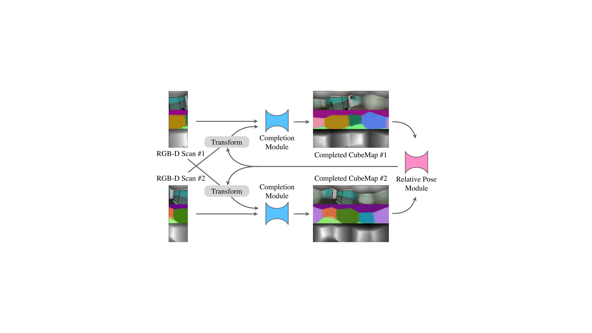

# requirements:
* pytorch (>0.4)
* open3d 
* scipy,sklearn

# folder preparation
please ensure to have following folder structure:
``` shell
RelativePose
    data
        dataList
    tmp
    experiments
```

# data download
images: [suncg](https://www.google.com),[matterport](https://www.google.com),[scannet](https://www.google.com)<br/>
dataList: [suncg](https://www.google.com),[matterport](https://www.google.com),[scannet](https://www.google.com)<br/>
pretrained model: [suncg](https://www.google.com),[matterport](https://www.google.com),[scannet](https://www.google.com)<br/>

# training feature network
## suncg
```python
python mainFeatureLearning.py --exp featSuncg --g --batch_size=2 --featurelearning=1 --maskMethod=second --resume --dataList=suncg --outputType=rgbdnsf --snumclass=15
```

## matterport
```python
python mainFeatureLearning.py --exp featMatterport --g --batch_size=2 --featurelearning=1 --maskMethod=second --resume --dataList=matterport --outputType=rgbdnsf --snumclass=15
```
## scannet
```python
python mainFeatureLearning.py --exp featScannet --g --batch_size=2 --featurelearning=1 --maskMethod=kinect --resume --dataList=scannet --outputType=rgbdnsf --snumclass=21
```
# training completion module
## suncg
```python
python mainPanoCompletion2view.py --exp compSuncg--g --batch_size=2 --featurelearning=1 --maskMethod=second --resume --dataList=suncg --outputType=rgbdnsf --snumclass=15
```
## matterport
```python
python mainPanoCompletion2view.py --exp compMatterport --g --batch_size=2 --featurelearning=1 --maskMethod=second --resume --dataList=matterport --outputType=rgbdnsf --snumclass=15
```
## scannet
```python
python mainPanoCompletion2view.py --exp compScannet  --g --batch_size=2 --featurelearning=1 --maskMethod=kinect --resume --dataList=scannet --outputType=rgbdnsf --snumclass=21 --useTanh=0
```
# train relative pose module
```python
python trainRelativePoseModuleRecFD.py --exp fd_param --dataset=suncg --snumclass=15 --split=val --para_init={param for previous iter} --rlevel={recurrent level}
```
# evaluation
```python
python evaluation.py --dataList={suncg,matterport,scannet} --method={ours,ours_nr,ours_nc,gs,cgs,super4pcs} --exp=eval --num_repeat=10 --para={param file}
```


